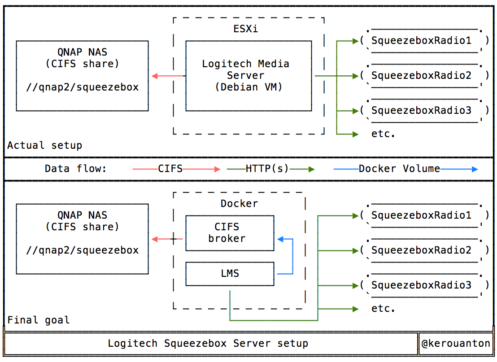

# dock-squeezebox-smb

CIFS-mounting container for my Squeezebox server

## Intro

I'm currently learning Docker and GIT, so I've trying to put something useful here as a first try.

## Current setup

My home music setup consists of several Logitech Squeezeboxes, served by a Logitech Media Server (LMS) running as a Debian VM on ESXi. The music files (mostly FLAC) are served to the LMS server via a CIFS share on my main NAS.

## Intended goal

My actual goal is to "dockerize" this setup, the following way: 

* a Boot2Docker engine VM on ESXi, to run the docker containers.
* squeezebox-smb : a docker container mounting the NAS share and serving it as a volume to the main container.
* squeezebox-lms : a docker container running LMS, exposing port 9000 (default on LMS) to the squeezebox radios and for the web portal.

## First issues

Since it's my first try, I found out some glitches and subtleties :

* boot2docker :
  - nothing special, it works quite well. For this, I tried several solutions, including Vagrant and Ansible, but the only solution I found efficient is with docker-machine, which natively supports vsphere (i.e. without paying a license and/or needing to pay for a full vSphere license).

* squeezebox-smb:
  - mounting a CIFS share within a docker container needs special rights when running the container.
  - Building on Alpine instead of Debian works well, but needs a strict /etc/fstab syntax.
  - I didn't find out yet how to share the mounted CIFS directory as a volume to the other containers... help !

* squeezebox-lms:
  - todo.

## Todo

1. Finding a way to share the mounted CIFS share on squeezebox-smb to my other container (squeezebox-lms at the end).
2. Creating a Dockerfile for squeezebox-lms.
3. Learning to use docker-compose to build everything at once.
